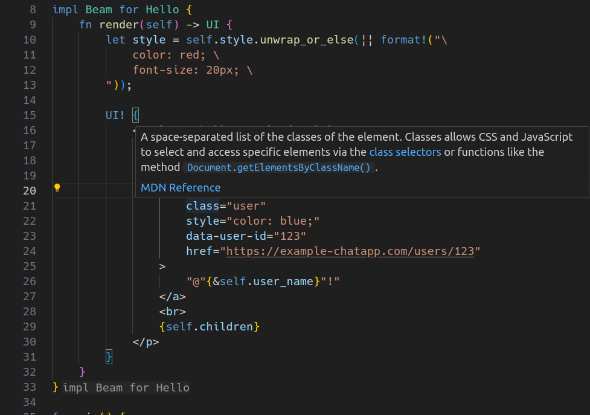

    <h1>
        UIBeam
    </h1>
    

        HTML completions and hovers for <a href="https://github.com/ohkami-rs/uibeam">UIBeam</a> - A lightweight, JSX-style HTML template engine for Rust.
    

### How it works

This extension automatically finds `UI! { ... }` in your `.rs` files, then calls VSCode's builtin HTML language service to provide completions and hovers for HTML tags/attributes in `UI! { ... }`s.\
File changes are tracked and keep working.

### Hover

### Completion

